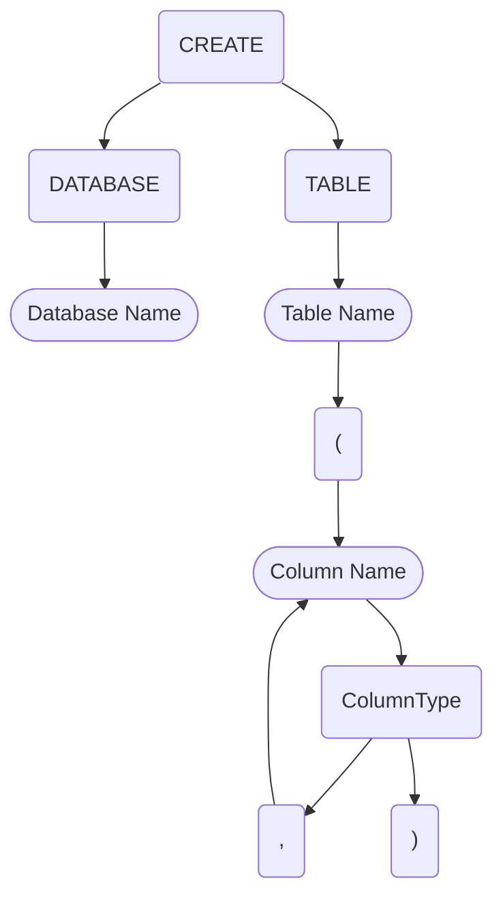

### Create

```mermaid
graph TB;
Crt(CREATE)
Crt --> D(DATABASE) --> ND([Database Name])
Crt --> T(TABLE) --> NT([Table Name]) --> BTF("(")
BTF --> NC([Column Name]) --> NCT(ColumnType) --> NDT0(,)
NDT0(,) --> NC
NCT --> BTB(")")
```