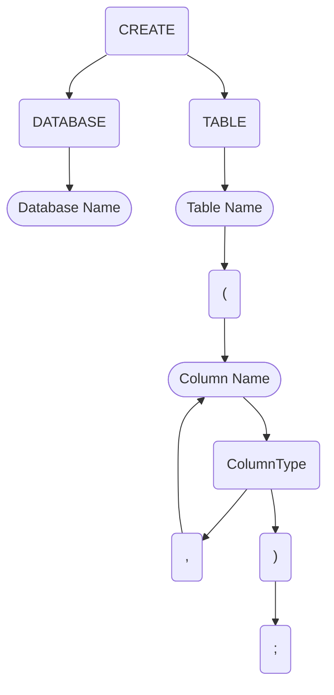
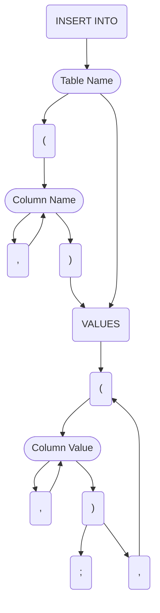

### Create

```mermaid
graph TB;
    Crt(CREATE) --> D(DATABASE) --> ND([Database Name])
    Crt --> T(TABLE) --> NT([Table Name]) --> BTF("(")
    BTF --> NC([Column Name]) --> NCT(ColumnType) --> NDT0(,)
    NDT0(,) --> NC
    NCT --> BTB(")") --> E(";")
```

### Insert

```mermaid
graph TB;
    Ist(INSERT INTO) --> NT([Table Name]) --> BTF("(")
    BTF --> NC([Column Name]) --> NDT0(,) --> NC --> BRT(")") --> Vals(VALUES)
    Vals --> BTF1("(") --> NV([Column Value]) --> NDT1(,) --> NV --> BRF1(")")
    NT --> Vals
    BRF1 --> E(";")
    BRF1 --> NDT2(,) --> BTF1
```