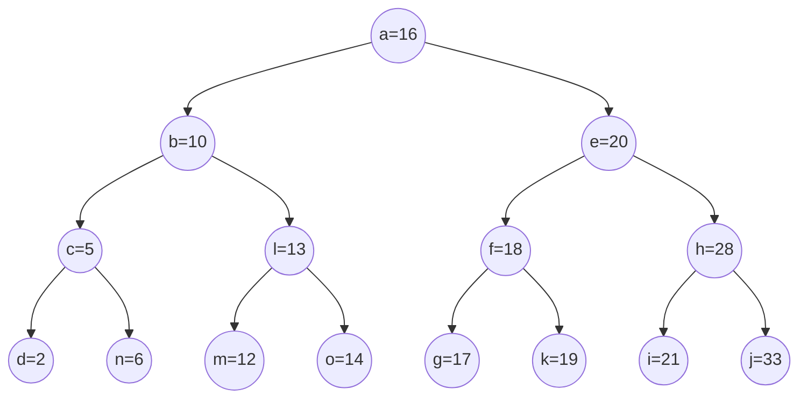

## 二叉查找树（BST）

### 概述

二叉查找树（Binary Search Tree）是一种基于二叉树的数据结构，它具有以下特点：

+ 左子树所有节点的值均小于根节点的值。
+ 右子树所有节点的值均大于根节点的值。
+ 左右子树也分别为二叉查找树。

### 结构分析

### 极限情况

### 自平衡

自平衡二叉树（Self-balancing Binary Search Tree，简称 SBBT）是一种能够自动保持平衡的二叉搜索树。其核心特点是：每当树的结构发生变化（如插入或删除节点）时，树会自动调整以保证树的平衡，从而避免退化成链表。

### 二叉搜索树（BST）的基本特性：
- 每个节点最多有两个子节点。
- 对于树中的每个节点，左子树的所有节点值都小于该节点的值，右子树的所有节点值都大于该节点的值。

### 自平衡二叉树的平衡条件：
自平衡二叉树不仅要满足二叉搜索树的性质，还要满足某种平衡条件。常见的平衡条件有：
1. **AVL 树**：每个节点的左子树和右子树的高度差（称为平衡因子）不超过 1。
2. **红黑树**：通过一组红黑色的节点和一定的规则，保证树的平衡性，从而提高查询、插入、删除等操作的效率。
3. **Splay 树**：通过“伸展”操作将访问的节点移动到树的根部，不保证严格的平衡，但通过伸展操作保持整体的较好性能。

### 平衡的意义：
- 在一个自平衡的二叉搜索树中，查询、插入和删除操作的时间复杂度通常是 \(O(\log n)\)，其中 \(n\) 是树中的节点数。
- 由于树始终保持平衡，深度较小，因此可以避免性能退化到链表形式（即 \(O(n)\) 的复杂度）。

### 维护平衡：
当进行插入或删除操作时，如果某个节点的左右子树的高度差超过允许的范围（例如，在 AVL 树中是 1），则需要通过旋转操作来恢复平衡。常见的旋转操作包括：
- **单右旋（右旋转）**

- **单左旋（左旋转）**

- **左右旋转**

> 先左旋，后右旋

- **右左旋转**

> 先右旋，后左旋

自平衡二叉树通过这些旋转操作能够有效地保持平衡，从而确保操作的时间复杂度保持在 \(O(\log n)\) 范围内。

这些树结构通常用于数据库索引、内存管理等需要频繁查询和更新数据的场景。

### 参考链接

[演示链接 - Data Structure Visualization](https://www.cs.usfca.edu/~galles/visualization/Algorithms.html)